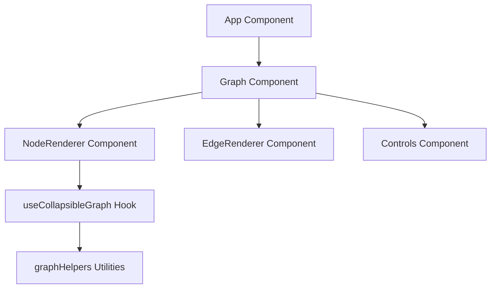

# Design Document

## Overview

The Cloud Infrastructure Security Visualization Tool is a web application that provides an interactive graph-based visualization of cloud infrastructure security issues. The application will display a hierarchical view of cloud environments, accounts, and services, highlighting security alerts and misconfigurations. Users can interact with the graph through features like zooming, panning, and collapsing/expanding nodes to focus on specific areas of interest.

## Architecture

The application follows a component-based architecture using React and TypeScript. The architecture consists of the following layers:

1. **Presentation Layer**: React components that render the UI and handle user interactions
2. **State Management Layer**: React hooks and context for managing application state
3. **Data Layer**: Utilities for processing and transforming graph data
4. **External Libraries**: Integration with React Flow for graph visualization



## Components and Interfaces

### App Component

The main container component that orchestrates the overall layout and state management.

```typescript
interface AppProps {
  // No props required for the root component
}
```

### Graph Component

Responsible for rendering the graph visualization using React Flow.

```typescript
interface GraphProps {
  data: GraphData;
  onNodeClick: (node: Node) => void;
  onNodeHover: (node: Node | null) => void;
}
```

### NodeRenderer Component

Custom renderer for different types of nodes (cloud, account, service) that includes the information component.

```typescript
interface NodeRendererProps {
  data: CustomNodeData;
  isConnectable: boolean;
  selected: boolean;
}

interface CustomNodeData {
  type: 'cloud' | 'account' | 'service' | 'aws' | 'gcp' | 'saas';
  label: string;
  alerts: number;
  misconfigs: number;
  children?: string[];
  isCollapsed?: boolean;
}
```

## Data Models

### Graph Data Model

```typescript
interface GraphData {
  nodes: GraphNode[];
  edges: GraphEdge[];
}

interface GraphNode {
  id: string;
  type: string;
  data: CustomNodeData;
  position: { x: number; y: number };
}

interface GraphEdge {
  id: string;
  source: string;
  target: string;
  type?: string;
}
```

### Sample Data Structure

```json
{
  "nodes": [
    { "id": "cloud", "label": "Cloud", "type": "cloud", "alerts": 253, "misconfigs": 18, "children": ["aws1", "aws2", "gcp", "saas"] },
    { "id": "aws1", "label": "AWS 1", "type": "aws", "alerts": 84, "misconfigs": 3, "children": ["s3"] },
    { "id": "aws2", "label": "AWS 2", "type": "aws", "alerts": 124, "misconfigs": 4, "children": ["rds"] },
    { "id": "gcp", "label": "GCP", "type": "gcp", "alerts": 28, "misconfigs": 9 },
    { "id": "saas", "label": "SaaS", "type": "saas", "alerts": 123, "misconfigs": 5 },
    { "id": "s3", "label": "S3", "type": "service", "alerts": 66, "misconfigs": 3 },
    { "id": "rds", "label": "RDS", "type": "service", "alerts": 68, "misconfigs": 1 }
  ],
  "edges": [
    { "source": "cloud", "target": "aws1" },
    { "source": "cloud", "target": "aws2" },
    { "source": "cloud", "target": "gcp" },
    { "source": "cloud", "target": "saas" },
    { "source": "aws1", "target": "s3" },
    { "source": "aws2", "target": "rds" }
  ]
}
```

## Error Handling

1. **Graph Rendering Errors**: Implement error boundaries around the graph component
2. **Empty States**: Show appropriate messages when no data is available
3. **Performance Monitoring**: Log performance issues when rendering large graphs

## Technical Decisions

### Code Organization

#### Import Structure

All files will follow a consistent import organization pattern:

```typescript
// Import Modules
import React, { useState, useEffect } from 'react';
import { someFunction } from 'external-library';

// Import Types
import type { SomeType, AnotherType } from '../types';

// Import Styles
import './Component.css';
import 'external-library/dist/style.css';

// Import Hooks
import { useCustomHook } from '../hooks';

// Import Components
import ChildComponent from './ChildComponent';
```

This structure ensures consistency across the codebase and makes imports easier to understand and maintain.

### React Flow

We chose React Flow as the graph visualization library because:

- It provides built-in support for interactive features like zooming, panning, and selecting nodes
- It has a flexible API for customizing node and edge rendering
- It handles the complex calculations for positioning and rendering graph elements efficiently
- It supports TypeScript for type safety

### Tailwind CSS

We chose Tailwind CSS for styling because:

- It provides a utility-first approach that speeds up development
- It ensures consistent styling across the application
- It makes responsive design easier to implement
- It reduces the need for custom CSS

### State Management

We will use React's built-in state management hooks:

- `useState` for simple component state
- `useReducer` for more complex state logic (like managing the graph's collapsed/expanded state)
- `useMemo` for derived state and performance optimization
- Context API for sharing state between components when necessary

### Layout Algorithm

We will use React Flow's built-in layout algorithms with some customizations:

- Hierarchical layout for the initial rendering
- Custom positioning logic for collapsed/expanded states
- Force-directed layout for automatic arrangement of nodes

## User Interface Design

### Main Layout

The application will have a single-panel layout:

- Full screen: Graph visualization with floating information components above each node

### Node Visualization

- Cloud nodes: Larger circles with cloud icons
- Account nodes: Medium-sized rectangles with account icons
- Service nodes: Smaller rectangles with service-specific icons
- Color coding based on alert severity:
  - Green: Few or no alerts
  - Yellow: Moderate number of alerts
  - Orange: High number of alerts
  - Red: Critical number of alerts

### Interactions

- Click: Toggle collapse/expand state for nodes with children
- Scroll/pinch: Zoom in/out
- Drag: Pan the graph
- Controls: Zoom in/out buttons, fit view button, and reset view button

### Responsive Design

- Desktop: Full-screen graph visualization with information components above nodes
- Tablet: Responsive graph with appropriately sized nodes and information components
- Mobile: Stack layout with simplified visualization and compact information components
